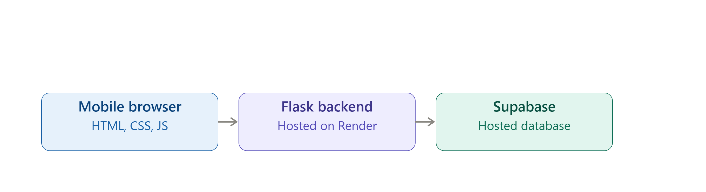

# Ballast — Student Stress & Workload Manager

**Team:** Beh Chun Yi, Clement Ho Jun Hao, Leong Zheng Yang, Chow Zhen Wai
**Problem Statement:** Stress & Workload Manager
**Video Presentation:** [Watch here](https://youtu.be/LlDxNvR2A2Y?si=s7BTxbPV1DPFQ2al)
**Presentation Slides:** BALLAST Presentation
**UI Prototype:** [View on Figma](https://www.figma.com/design/SMVK9spilAepCQa8931ZwP/Stress---Workload-Manager?node-id=0-1&p=f&t=YvE0uPsekvMMFkVw-0)

---

## 1. Project Overview

### The Problem

Students juggle five distinct kinds of load, mental (coursework, deadlines), time (a packed schedule with no slack), physical (sleep, energy), social (relationships, obligations), and errands (daily logistics), but these loads live in completely separate places. A school portal, a group chat, a calendar app, their own head, nothing brings them together. No single view shows how they add up, so students only notice they're overloaded after they've already burned out, not before. The problem isn't a lack of willpower, it's a lack of visibility until it's too late.

The people affected by this go beyond the students themselves. Students are the primary users, especially those juggling academics with part time work or family responsibilities, but university counseling and wellness offices also deal with the downstream cost of late detected burnout, and parents and academic staff often notice performance drops without understanding the cause behind them.

Existing solutions on the market don't close this gap either. Task managers like Todoist or Notion track what needs doing, but they treat every item the same. A 10 minute errand and a stressful exam sit side by side with no sense of emotional weight, and once a task is logged the app's job is done. Wellness apps like Headspace address recovery in isolation. A meditation session doesn't know the load that's causing the stress in the first place, so the recommendation is generic rather than targeted. Neither type of app connects how loaded a student is right now to what they should specifically do about it, which is exactly the gap our solution closes.

### The Solution

Ballast gives students a single, cross domain view of their load, covering mental, time, physical, social, and errands, represented as five fill levels that make imbalance visible at a glance. Instead of just logging and reporting, it actively pushes students toward two kinds of action: rebalancing the load itself (cutting or deferring something specific) and recovery (a concrete action like stepping outside or sleeping earlier). Daily check ins and a streak mechanic keep it something students actually return to, rather than a one time survey.

**Feature set**
- Five dimension daily check in (mental / time / physical / social / errands)
- At a glance visual comparison across all five dimensions
- Tiered urgency system (steady / stacking up / running hot) that scales the response to how loaded the student actually is
- Targeted, actionable suggestions split into rebalancing (reduce the load) and recovery (restore energy)
- Streak and trend tracking to encourage daily return use

---

## 2. Ideation & Process

### 2.1 Ideas We Considered

| Idea | Why it was dropped / kept |
|---|---|
| **A (Chosen): Ballast, five dimension load visualization with rebalance and recovery prompts** | Chosen because it directly matches the requirement to give students a clear picture across all five load areas, mental, time, physical, social, and errands, and to actively push students toward action instead of only tracking and reporting. |
| **B (Dropped): A single overall load score, no separate dimensions** | This was considered as a simpler starting point since it would have been faster to build. It was dropped because collapsing everything into one number hides exactly the information students need. A student could look moderately stressed overall while one specific area, like errands or social load, is actually the one pushing them toward burnout. The problem statement explicitly asks for visibility across separate areas, so this direction couldn't stay as the final approach. |
| **C (Dropped): A plain to do list app** | This was one of the earliest ideas raised, since task lists are the most familiar format for managing schoolwork. It was dropped quickly because a to do list only records what needs doing, it doesn't measure how heavy any of it feels, and it stops at logged, with no push toward rebalancing or recovery. This is close to what several existing apps on the market already do, so it wouldn't have been a meaningful contribution. |

### 2.2 Ideation Boards

**User Flow**

| Step | User action | Product response |
|---|---|---|
| 1 | Opens the app and completes a sixty second check in, dragging five sliders for mental, time, physical, social, and errands | Shows an immediate status, steady, loaded, or running hot, on the dashboard |
| 2 | Views the dashboard | Sees all five areas side by side with percentages, plus a one line explanation of what is driving the current status |
| 3 | Taps into a specific area, for example mental load | Shows a seven day trend for that one dimension, so the student can see whether today is a spike or a pattern |
| 4 | Reviews the suggestions for that area | Sees two separate lists, options that rebalance the load itself, and options that restore energy, so the two kinds of response are never mixed together |
| 5 | Picks a recovery option, for example a twenty minute walk | Opens a recovery session with a timer and a preview of expected impact on the two areas it affects |
| 6 | Completes the session and returns to the dashboard | Updates today's status and adds to the daily check in streak, encouraging the student to come back tomorrow |

This flow shows the two layers the product actually has, a fast daily overview, and an optional deeper look at any one area that is running high, with a concrete action attached at both layers.

*(Add your brainstorming photo or mind map image here, for example: ``, with one or two lines explaining what it shows.)*

### 2.3 Mentor Consultation

| Date | Mentor | Feedback Received | What Was Changed |
|---|---|---|---|
| 13/9/2026 | Khor Jia Qian | *(fill in after the session)* | *(fill in after the session)* |

---

## 3. Design & Prototype

**UI Prototype:** [View on Figma](https://www.figma.com/design/SMVK9spilAepCQa8931ZwP/Stress---Workload-Manager?node-id=0-1&p=f&t=YvE0uPsekvMMFkVw-0)


The five dimension daily check-in with sliders for mental, time, physical, social, and errands.

*(Add more screens below the same way, aim for 4 to 8 total, each with its own caption, for example:)*

```

The at-a-glance load comparison, showing an overall status of Running Hot.
```

---

## 4. What Makes It Different

Ballast shows a trend, not just a snapshot. Tapping into any one dimension surfaces a seven day history for that specific area, so a student can tell the difference between a single rough day and a pattern that is heading toward burnout. Most similar tools only show how someone feels right now.

Ballast splits every suggestion into two separate lanes instead of one mixed list. Rebalance options change the load itself, for example asking for an extension or declining a new commitment. Recovery options restore energy, for example a short walk or earlier sleep. Keeping these separate means the student always knows whether an action is meant to remove pressure or to recharge from it.

Ballast shows the expected outcome before the student commits to an action. A recovery session previews its impact on the two areas it affects before the timer even starts, so the suggestion isn't just do this, it's here is what this specific action is likely to change.

Ballast treats different kinds of load differently. Task heavy areas like errands get sorted by urgency, urgent, moderate, and chill, while energy heavy areas like physical load get a body battery style reading. The same interface adapts to what kind of load it is showing, instead of forcing every dimension into one generic scale.

---

## 5. Technical Architecture & Feasibility

### Tech Stack

Frontend is built with HTML, CSS, and vanilla JavaScript, structured as a mobile first single page app, chosen for fast iteration without build tooling under hackathon time pressure. Flask serves the page and handles routing between the dashboard and the per dimension detail screens. Supabase stores the data, chosen because its free tier is enough for a hackathon demo and because it needs to hold more than a single day's numbers. Every dimension needs at least a seven day history for its trend chart, so each check in is stored as its own row rather than overwriting a single current value. The known constraint is that Supabase should not be called directly from the frontend, since that would expose the project key, so requests are routed through the Flask backend as a light proxy layer. Hosting is planned through a free tier service such as Render or Railway for the Flask backend, paired with Supabase's own hosted database, so no separate server management is required during the hackathon.

### System Architecture Diagram

*(Save the architecture diagram shown in chat and upload it as its own file, for example `architecture.png`, then embed it here with: ``. Use a different filename from the check-in screenshot above, they are two different images.)*

A mobile browser client sends requests to a Flask backend, which proxies queries to a Supabase database. Flask sits in between so the Supabase project key is never exposed to the browser.

### Build Plan & Scope

Given how much the prototype currently shows, the build phase is split into two tiers so the scope stays realistic.

**Core, must be working for the demo:** the daily check in with five sliders, the dashboard with all five percentages and an overall status, one fully working detail screen (mental load) with its seven day trend and its rebalance and recovery lists, and one working recovery session with a timer and expected impact preview.

**Time permitting, built if the core is done early:** detail screens for the remaining three dimensions (time, social, and physical), the task level breakdown for errands with urgency tiers, the focus session flow for task based work, and full streak and trend tracking across all five dimensions rather than just mental load.

**Explicitly out of scope for this phase:** account systems and login, cross device sync beyond a single Supabase table, calendar integration, and push notifications. These are noted as future work so the team is not attempting them during the limited build window.

### Future Possibilities

- Weekly workload trends and lighter day suggestions based on the trend line
- Calendar import and export, so upcoming deadlines feed directly into the time dimension
- Optional AI reflection that turns a running hot day into one small, personalized next step instead of a generic suggestion, with an offline fallback
- Campus support links selected by region, with careful privacy and safety review

### Safety and Scope

Ballast is a productivity prototype, not a medical or mental health diagnostic tool. A production version should be reviewed with student support professionals, provide region appropriate support resources, and make privacy choices explicit.
